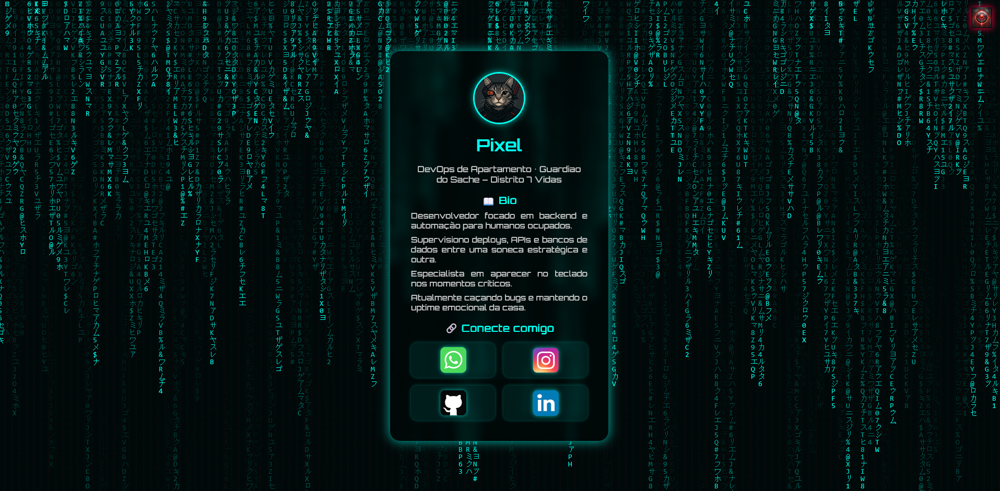
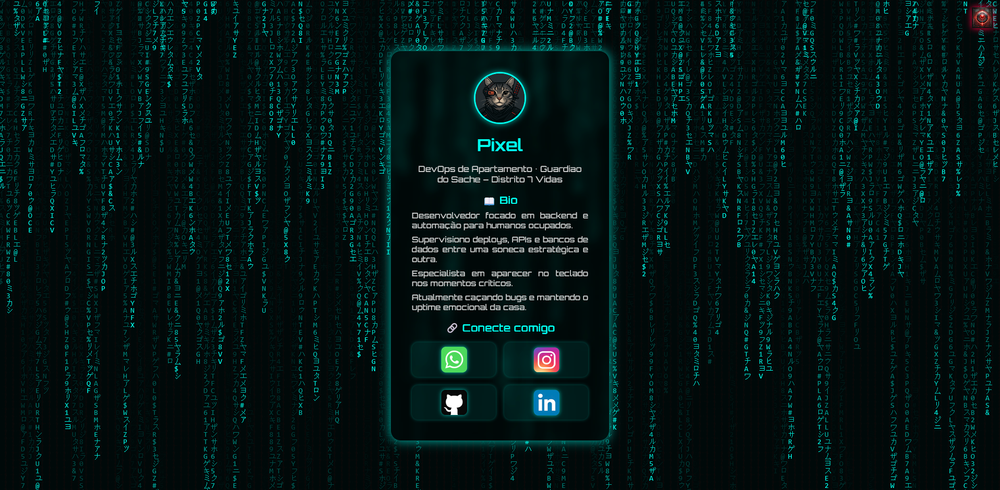
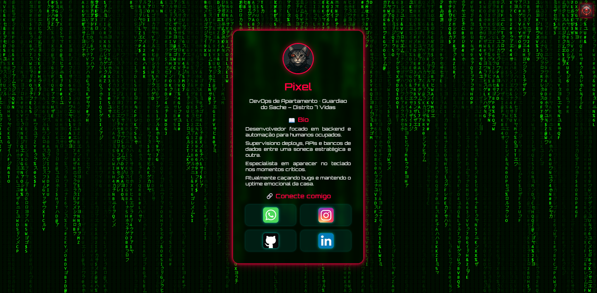

# Cartão Digital NFC — Case Study

> 📌 Estudo de caso de uma aplicação web para cartão digital dinâmico, desenvolvida em contexto profissional.
> 🔒 O código-fonte original não está disponível publicamente por questões de confidencialidade e propriedade intelectual.

  

  
  
  

  

---

## ✨ Visão Geral

O **Cartão Digital NFC** é uma aplicação web criada para apresentar perfis digitais de forma dinâmica, responsiva e visualmente personalizada.

A proposta do projeto foi conectar um cartão físico com NFC a uma página online com informações de contato, bio, links sociais e identidade visual customizada.

Para esta apresentação de portfólio, a demonstração utiliza o personagem **Pixel**, um perfil fictício criado para valorizar a interface e mostrar a experiência da aplicação de forma mais visual e memorável.

---

## 🎬 Demonstração

Abaixo, uma demonstração rápida da interface em funcionamento:

  

---

## 🚀 Destaques do Projeto

* Perfil digital carregado dinamicamente por identificador na URL
* Interface visual personalizada
* Links sociais interativos
* Estrutura pensada para múltiplos perfis
* Integração com banco de dados PostgreSQL
* Troca visual de tema/cor pela interface
* Aplicação web leve, objetiva e com foco em apresentação

---

## 🧰 Stack Utilizada

* **Python**
* **Flask**
* **PostgreSQL**
* **HTML**
* **CSS**
* **JavaScript**
* **Jinja Templates**
* **Linux / Deploy Web**

---

## 👨‍💻 Minha Participação

Atuei no desenvolvimento da aplicação web, estruturação das rotas, integração com banco de dados, renderização dinâmica dos perfis e organização da interface.

Também participei da configuração do ambiente de execução e da validação do fluxo entre cartão NFC, página web e dados do perfil.

---

## 🧠 Decisões Técnicas

A aplicação foi estruturada com **Flask** para manter o backend simples, direto e fácil de publicar em ambiente web.

Os dados dos usuários foram armazenados em **PostgreSQL**, permitindo que diferentes perfis fossem carregados dinamicamente a partir de um identificador na URL.

A interface foi construída com foco em **impacto visual, responsividade e acesso rápido aos links principais**, valorizando a experiência de uso.

---

## 🖼️ Galeria

### Tema principal

  

### Variação visual / troca de tema

  

---

## 📚 Aprendizados

Este projeto reforçou minha experiência com:

* desenvolvimento backend com Flask
* aplicações web dinâmicas
* integração com banco de dados PostgreSQL
* organização de assets e renderização de conteúdo dinâmico
* construção de interfaces voltadas para uso real

Também foi um exercício importante de produto, transformando uma necessidade simples de apresentação de contato em uma experiência digital mais visual, personalizável e memorável.

---

## 🔒 Nota de Confidencialidade

Este repositório apresenta apenas um **estudo de caso sanitizado**.

O código-fonte original não está disponível publicamente porque foi desenvolvido em contexto profissional e pode conter detalhes de implementação, marca ou informações pertencentes à empresa.

Nenhum dado sensível, credencial, informação interna ou código proprietário está incluído neste repositório.
